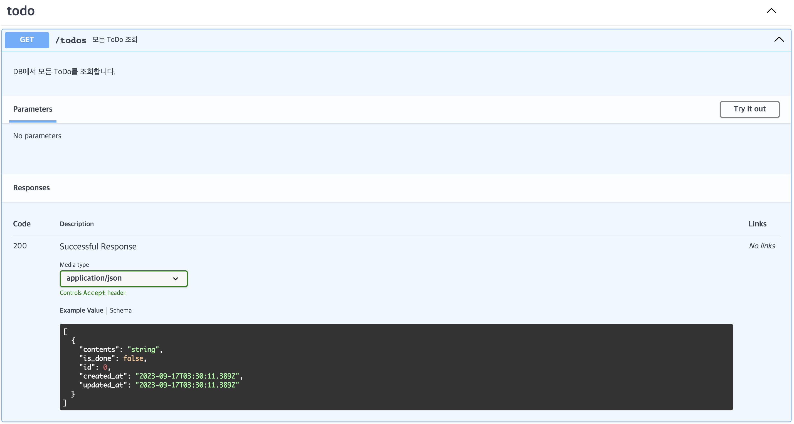

# FastAPI - w1

Hong Namsoo

---

<style scoped>
pre {
    font-size: 16px;
}
</style>

## Before to start

- I used [poetry](https://python-poetry.org/) for package management
- I used project structure like below

```python
├── README.md  # readme for project
├── fastapi_study  # actual package (actual project root)
│   ├── __init__.py
│   ├── core  # core module
│   │   └── exceptions.py  # custom exceptions
│   ├── database.py  # database connection
│   ├── models  # sqlalchemy models for database
│   │   ├── __init__.py  # model base
│   │   └── todo.py  # todo model
│   ├── routers  # fastapi routers for api
│   │   └── todo.py  # todo router
│   ├── schemas  # pydantic schemas for api
│   │   ├── errors.py  # error schemas
│   │   └── todo.py  # todo schemas
│   └── services  # business logic
│       └── todo.py  # todo service
├── main.py  # fastapi app
├── poetry.lock
├── pyproject.toml
├── requirements.txt
└── tests
    └── __init__.py
```

<!--
시작하기에 앞서, 저는 poetry를 사용하였으며, 아래와 같이 프로젝트를 구성하였습니다.
본 구성은 영상과 다르며, 저는 이 구성을 더 선호합니다.
-->

---

# INDEX

1. `/todos`

<!--
저는 기존 영상 대비 sqlalchemy와 pydantic의 버전을 올리며 발생하는 변경사항에 대해 설명하고자 합니다.

-->

---

<style scoped>
pre {
    font-size: 20px;
}

svg[id^="mermaid-"] { 
    min-width: 480px; 
    max-width: 480px; 
    min-height: 360px; 
    max-height: 360px; 
  }
</style>

# 1. `/todos` - Flow

<div class="mermaid">
graph LR;
    A[Client]-->B[FastAPI Server];
    B-->C[Router];
    C-->D[todos GET];
    C-->E[todos POST];
    C-->F[todos/id GET];
    C-->G[todos/id PATCH];
    D-->H[ToDoService];
    E-->H;
    F-->H;
    G-->H;
    H-->I[ToDoModel];
    I-->J[DB];
</div>

<!--
기본적으로 프로젝트의 흐름은 위와 같습니다.
클라이언트로부터 요청이 들어오면, FastAPI 서버에서 해당 요청을 처리하기 위해 Router로 요청을 전달합니다.
Router는 요청을 처리하기 위해 Service를 호출하며, Service는 비즈니스 로직을 처리하기 위해 Model을 호출합니다.
Model은 DB에 접근하여 데이터를 가져오거나 저장합니다.
-->

---

<style scoped>
pre {
    font-size: 18px;
}
</style>

# 1.1. `/todos` - Router

- FastAPI supports APIRouter for grouping APIs

```python
"""
routers/todo.py  # Define router for /todos

"""
from typing import Annotated  # Type Hinting recommended by FastAPI
#

from fastapi import APIRouter, Depends, HTTPException
from fastapi import Body, Path, Query
from sqlalchemy.orm import Session

router = APIRouter()  # Create new router for /todos
...  # Define APIs
```

```python
"""
main.py  # Include router to FastAPI app
"""
from fastapi_study.routers import todo
...
# Include router to FastAPI app
# Delegate /todos to todo.router
app.include_router(todo.router, prefix="/todos")
```

<!--
-->

---

<style scoped>
pre {
  font-size: 18px;
}
</style>

# 1.2. `/todos` - API

```python
from fastapi_study.services import todo as todo_service  # Service
from fastapi_study.core import exceptions  # Custom exceptions
from fastapi import APIRouter, Depends, HTTPException, status  # FastAPI

@router.get(
    "/{todo_id}",
    tags=["todo"],
    response_model=ToDoRead,
    summary="특정 ToDo 조회",
    description="특정 ToDo를 조회합니다."
)
async def get_todo(
    todo_id: Annotated[int, Path(..., description="조회할 todo id", ge=1)],  # int path type data greater than or equal to 1
    db: Annotated[Session, Depends(get_db)]
):
    try:
        return todo_service.get_todo_by_id(todo_id, db)  # Call business logic
    except exceptions.TodoNotFoundError as e:  # Custom exceptions
        raise HTTPException(status_code=status.HTTP_404_NOT_FOUND, detail=str(e))  # Raise HTTPException with 404 status code

@router.post(
    "",
    tags=["todo"],
    response_model=ToDoRead,
    summary="새로운 ToDo 생성",
    description="새로운 ToDo를 생성합니다.",
    status_code=status.HTTP_201_CREATED,
)
async def create_todo(
    new_todo: ToDoCreate,
    db: Annotated[Session, Depends(get_db)]
):
    try:
        return todo_service.create_new_todo(new_todo, db)
    except exceptions.TodoNotFoundError as e:
        raise HTTPException(status_code=status.HTTP_404_NOT_FOUND, detail=str(e))
```

<!--
API는 아래와 같이 정의하였습니다.
대부분 영상과 같고, 다른 부분만 설명하고 넘어가겠습니다.
1. 함수의 타입을 지정할 때, FastAPI에서 권장하는 Annotated를 사용하였으며, Path에는 ge(>=)를 사용하여 1 이상의 정수만 받도록 하였습니다.
2. 데코레이터에는 summary, description, tags 등을 지정할 수 있으며, 이는 Swagger UI에 표시됩니다.
3. TodoNotFoundError는 custom exception으로, 서비스 내부에서 raise시 HTTPException으로 변환하여 반환합니다.
4. status_code는 fastapi의 status를 사용하여 좀 더 직관적으로 보이도록 하였습니다.
-->

---

# 1.2. `/todos` - API



<!--
사진에 보이는 것처럼 Swagger UI에서 tags, summary, description 등이 표시됩니다.
-->

---

<style scoped>
pre {
  font-size: 18px;
}
</style>

# 1.3. `/todos` - Service

```python
from fastapi_study.models.todo import ToDo as ToDoModel  # SQLAlchemy Model
from fastapi_study.schemas.todo import ToDoCreate as ToDoCreateSchema  # Pydantic Schema

from sqlalchemy import select  # Select statement by SQLAlchemy
from sqlalchemy.orm import Session  # SQLAlchemy Session

def get_all_todos(db: Session) -> list[ToDoModel]:
    """
    모든 ToDo를 조회합니다.
    """

    stmt = select(ToDoModel)  # Make select statement from ToDoModel
    return db.scalars(stmt).all()  # Execute select statement and return result

def create_new_todo(
    new_todo: ToDoCreateSchema,
    db: Session
) -> ToDoModel:
    """
    새로운 ToDo를 생성합니다.
    """
    todo = ToDoModel(**new_todo.model_dump())  # Make new ToDoModel from ToDoCreateSchema with model_dump(dict() in 1.x)
    db.add(todo)
    db.commit()
    db.refresh(todo)
    return todo
```

<!--
사실 서비스와 레포지토리를 명확하게 나누면 더 좋겠지만, 지금은 간단한 프로젝트이므로 서비스에서 바로 DB에 접근하도록 하였습니다.
get_all_todos는 모든 ToDo를 조회하는 함수입니다. select 함수를 사용하여 모든 ToDo를 조회하고, db.scalars를 사용하여 결과를 반환합니다.
create_new_todo는 새로운 ToDo를 생성하는 함수입니다. ToDoCreateSchema를 사용하여 새로운 ToDoModel을 생성하고, db.add를 사용하여 DB에 저장합니다.
-->

---

<style scoped>
pre {
  font-size: 18px;
}
</style>

# 1.4. `/todos` - Model

```python
import datetime

from sqlalchemy import DateTime
from sqlalchemy import func
from sqlalchemy.orm import DeclarativeBase
from sqlalchemy.orm import Mapped, mapped_column


class Base(DeclarativeBase):
    """
    Base model for other models
    """

    # created_at, updated_at are common columns for all models
    created_at: Mapped[datetime.datetime] = mapped_column(
        DateTime(timezone=True), server_default=func.now()
    )
    updated_at: Mapped[datetime.datetime] = mapped_column(
        DateTime(timezone=True), server_default=func.now(), onupdate=func.now()
    )

class ToDo(Base):
    """
    ToDo model
    """

    __tablename__ = "todo"

    # Mapped[int] is type hinting for PEP 484
    # mapped_column is for SQLAlchemy to use orm explicitly
    id: Mapped[int] = mapped_column(primary_key=True)
    contents: Mapped[str] = mapped_column(String(256), nullable=False)
    is_done: Mapped[bool] = mapped_column(Boolean, nullable=False, default=False)
```

<!--
모델은 아래와 같이 정의하였습니다.
1. Base는 모든 모델의 기본이 되는 모델입니다. 모든 모델에는 created_at, updated_at이 있으므로, Base에 정의하였습니다.
2. ToDo는 실제로 사용하는 모델입니다. id, contents, is_done을 정의하였습니다.
3. Mapped는 PEP 484를 위한 타입 힌트입니다.
4. mapped_column은 SQLAlchemy에서 명시적으로 orm을 사용하는 컬럼을 위한 것입니다.
-->
